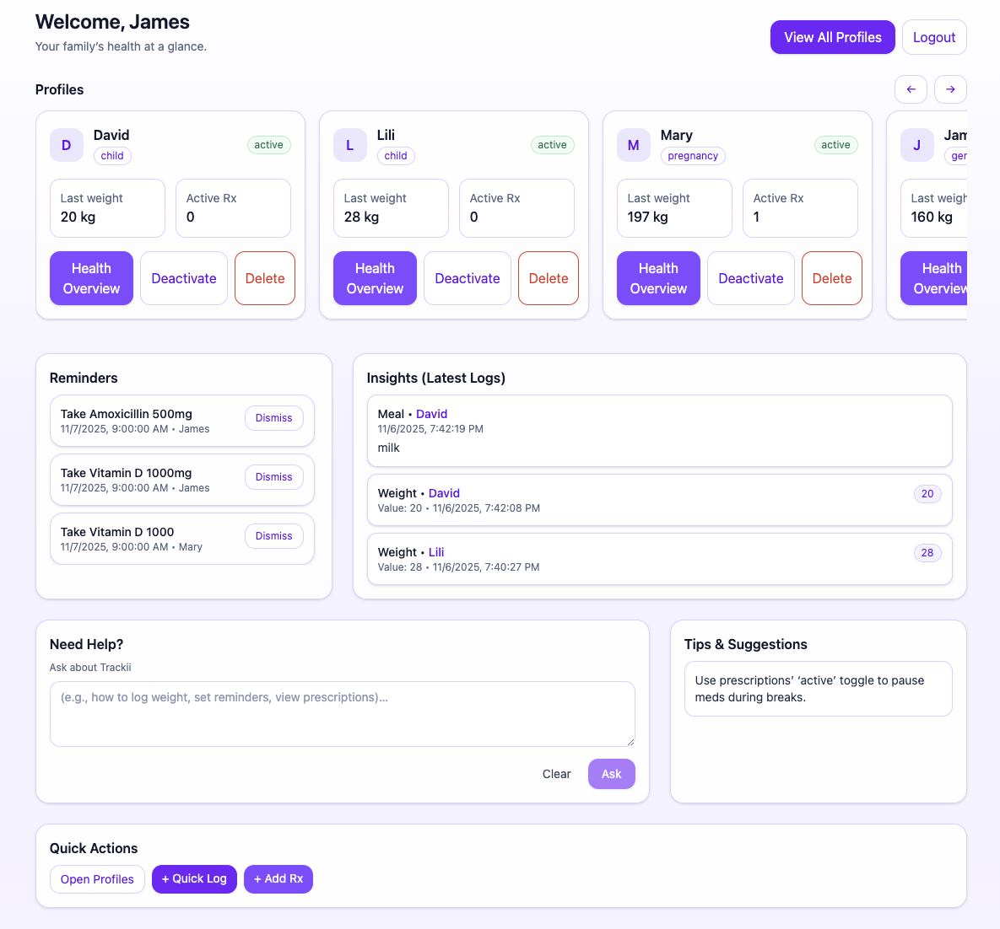

# Trackii

**Trackii** is a personal and family wellness tracker built with **React, Express, MongoDB, and Tailwind CSS**.  
It helps users log daily health data such as **weight, meals, water intake, and prescriptions**, while providing a clean, modern dashboard to visualize progress and stay organized.  

Trackii is designed as a simple yet expandable foundation for managing health and wellness over time.

---

## Features (MVP)
- **Multi-Profile Dashboard** – Manage multiple profiles (general, pregnancy, or child)  
- **Health Logs** – Record daily weight, meals, and water intake  
- **Prescription Manager** – Track medications with dosage, frequency, and active status  
- **Reminders System** – Intelligent medication and hydration reminders with dismiss logic  
- **Insights** – Displays recent logs and key metrics  
- **Visual Trends** – Weight charts for tracking progress  
- **Ask AI (Beta)** – Ask general wellness questions using the Wikipedia API (no medical advice)  
- **Secure Authentication** – JWT-based login and registration  
- **Modern UI** – Built with Tailwind CSS for a professional, responsive interface 

---

## Future Enhancements
- Sleep tracking
- AI-powered health assistant for questions and insights
- Push/email notifications
- Light/Dark mode

---

## Tech Stack
**Frontend:** React, Tailwind CSS  
**Backend:** Node.js, Express  
**Database:** MongoDB, Mongoose  
**Auth:** JWT  

---

## Wireframes & Planning
**Trello:** [Link](https://trello.com/invite/b/68faf8e78569b54f26b80345/ATTIbdf65515c8063379e9f76acb698ddbc54A81F0B5/trackii)

**ERD:** [Link](https://lucid.app/lucidchart/d20c641a-805a-4d59-a644-a49e2b51348f/edit?viewport_loc=-703%2C-647%2C1888%2C1575%2C0_0&invitationId=inv_04164fa0-450f-4a68-b91d-912863814899)

**Wireframes:** [link](https://excalidraw.com/#json=fE6UdJIw_oyGBtywbQmJn,cKanSgLhCUI19IexaLv_gA)